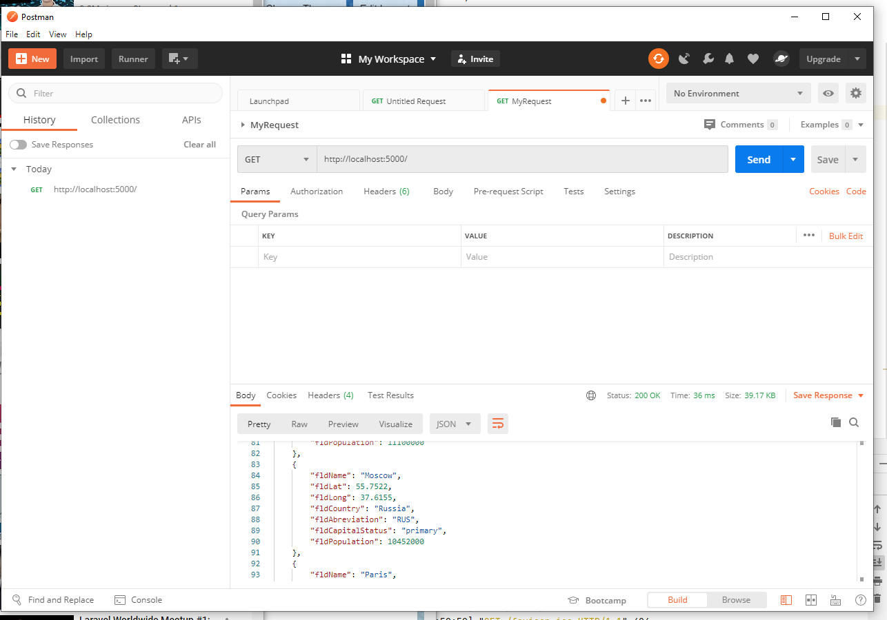
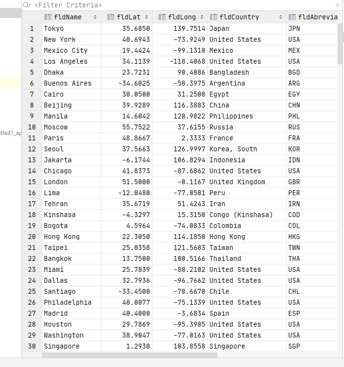

# Project Description
This project is a homework assignement to teach how to get a Pycharm setup with Docker, Flask, MySQL and Postman.
[Download Assignment Here](PPFSQL-Homework.pdf)
[View Assignment Video Here](https://youtu.be/QbMWNgrfAFg)
# Postman Screenshot

# SQL Data Screenshot

